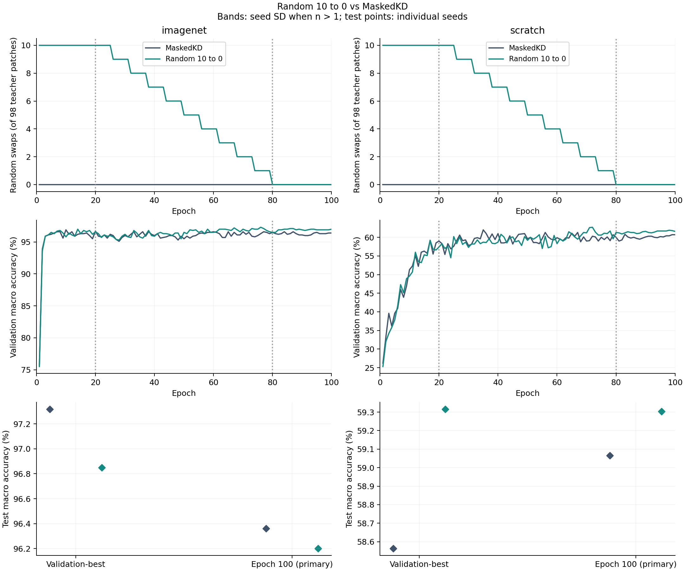

# Random 10→0 vs MaskedKD

Two-arm schedule comparison, not proof that decay beats constant Random 10. Seed 0 is a pilot; the existing test set has already been examined.

Student sees 196 patches; teacher always sees 98. Random replacements: 10 through epoch 20, integer linear decay to 0 at epoch 80, then 0. No LR/optimizer restart.

| Init | Seed | Method | Best epoch | Val best % | Val last % | Test best % | Test last % |
|---|---:|---|---:|---:|---:|---:|---:|
| imagenet | 0 | MaskedKD | 10 | 96.900 | 96.400 | 97.318 | 96.360 |
| imagenet | 0 | Random 10 to 0 | 76 | 97.300 | 97.000 | 96.850 | 96.201 |
| scratch | 0 | MaskedKD | 35 | 62.000 | 60.700 | 58.563 | 59.066 |
| scratch | 0 | Random 10 to 0 | 72 | 62.700 | 61.600 | 59.316 | 59.303 |

`main_scratch.png` / `main_imagenet.png`: raw student selection and teacher KL curves. `paired_seed_differences.csv`: schedule minus MaskedKD, both best/last. `learning_curves.csv`: actual swaps per epoch. Repeated probe images are not extra seeds.
